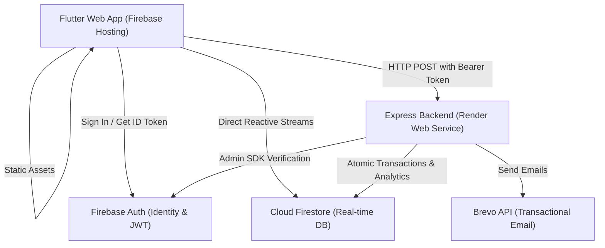

# OralScope — User Guide & Live Demo Script

> **Comprehensive User Manual and Step-by-Step Presentation Guide** for the OralScope Dental Clinic Management System.

---

## Table of Contents

1. [System Overview](#system-overview)
2. [Hybrid Production Architecture](#hybrid-production-architecture)
3. [Portals & Role-Based Access](#portals--role-based-access)
4. [Step-by-Step Demo Script](#step-by-step-demo-script)
   - [Act 1: Patient Self-Service Booking](#act-1-patient-self-service-booking)
   - [Act 2: Staff Review & Confirmation](#act-2-staff-review--confirmation)
   - [Act 3: Walk-In Booking & Concurrency Control](#act-3-walk-in-booking--concurrency-control)
   - [Act 4: Admin Dashboard & Clinic Management](#act-4-admin-dashboard--clinic-management)
   - [Act 5: Technical & Architecture Showcase](#act-5-technical--architecture-showcase)
5. [Demo Accounts & Credentials](#demo-accounts--credentials)
6. [Presenter Tips & FAQ](#presenter-tips--faq)

---

## System Overview

**OralScope** is a modern, full-stack clinic management platform engineered for single-dentist dental practices. It unifies both internal clinical workflows and customer-facing patient self-service into a single responsive **Flutter Web** application.

### Key Capabilities
- **Zero Double-Booking Guarantee:** Transactional slot-locking algorithms prevent overlapping appointments across walk-ins and online bookings.
- **Dual-Portal Interface:** Automatic role-based routing directs users to either the **Staff/Admin Portal** or the **Patient Portal**.
- **Automated Patient Notifications:** Dynamic transactional email confirmations and status updates via Brevo.
- **Comprehensive Audit Trail:** Immutable activity logs capturing state changes, cancellations, and administrative modifications.

---

## Hybrid Production Architecture

To eliminate the mandatory billing card requirement of Google Cloud Functions while retaining 100% free-tier operation, OralScope uses a **hybrid cloud architecture**:



- **Frontend:** Flutter Web hosted globally on **Firebase Hosting** (`https://dental-clinic-ams.web.app`).
- **Database & Auth:** **Cloud Firestore** and **Firebase Authentication** on the Firebase Spark (free) tier.
- **Backend API:** Custom **Node.js + Express** service hosted on **Render** (free tier).
- **Client Client-Side Dual Mode:**
  - In local development (`ENV=dev`), `FunctionsClient` seamlessly targets the **Firebase Emulator Suite**.
  - In production (`BACKEND_URL` set), `FunctionsClient` executes authenticated HTTP POST requests (`Authorization: Bearer <idToken>`) against the Render API.

---

## Portals & Role-Based Access

The application features three distinct access tiers:

| Role | Access Scope | Primary Actions |
|---|---|---|
| **Admin** | Staff Portal (Full Privileges) | Review queue, walk-in desk, calendar, analytics dashboard, service catalog CRUD, operating hours, staff management, audit log. |
| **Staff** | Staff Portal (Operational) | Review queue, walk-in desk, appointment status updates, calendar viewing. |
| **Patient** | Patient Portal | Multi-step appointment booking wizard, upcoming/past appointment records, profile settings. |

---

## Step-by-Step Demo Script

This script is organized into 5 sequential acts designed for a compelling live demonstration or stakeholder walkthrough.

---

### Act 1: Patient Self-Service Booking
*Goal: Show the smooth, modern patient booking experience and real-time validation.*

1. **Navigate to the Live URL:** Open [`https://dental-clinic-ams.web.app`](https://dental-clinic-ams.web.app) in your browser.
2. **Access the Patient Portal:**
   - Click the built-in **"👤 Quick Login: Patient"** button for instant 1-click access to Juan Dela Cruz (`patient1@clinic.test`), or click **"Sign Up"** to create a fresh test patient account.
3. **Launch the Booking Wizard:**
   - Click **"Book Appointment"**.
   - **Step 1 — Select Service:** Choose a service (e.g., *Dental Cleaning* or *Root Canal*). Note how duration and pricing dynamically display.
   - **Step 2 — Select Date & Time Slot:** Select a date. Highlight that available slots are dynamically computed in real-time from clinic hours, filtering out existing bookings.
   - **Step 3 — Patient Notes:** Enter a reason for visit or notes.
   - **Step 4 — Review & Confirm:** Click **"Confirm Booking"**.
4. **Result:** The appointment immediately appears under the patient's **Upcoming Appointments** in `Pending` status.

---

### Act 2: Staff Review & Confirmation
*Goal: Demonstrate the real-time synchronization between patient actions and staff operations.*

1. **Log in as Staff/Admin:**
   - Log out of the patient account and click **"👑 Quick Login: Admin"** on the login screen (or sign in manually with `admin@clinic.test` / `password123`).
2. **Review Queue:**
   - Navigate to the **Review Queue** in the sidebar.
   - Show the newly submitted patient booking appearing at the top with a **Pending** badge.
3. **Inspect & Confirm:**
   - Click on the appointment to open details.
   - Click **"Confirm Appointment"**.
4. **Behind the Scenes:**
   - A request is dispatched to Render (`POST /api/updateAppointmentStatus`).
   - Render verifies the staff member's Firebase JWT, commits the status transition in Firestore, and triggers an automated confirmation email to the patient.
   - The status updates instantly across all connected screens via Firestore reactive streams.

---

### Act 3: Walk-In Booking & Concurrency Control
*Goal: Demonstrate rapid front-desk booking and transactional collision prevention.*

1. **Navigate to Walk-In Booking:**
   - In the Staff Portal, click **"Walk-In Booking"**.
2. **Rapid Patient Intake:**
   - Fill in:
     - **First Name**: `Maria`
     - **Last Name**: `Santos`
     - **Phone Number**: `09171234567`
     - **Service**: Select a dental service.
     - **Date & Slot**: Choose an available time slot.
   - Click **"Create Appointment"**.
3. **Highlight Key Distinction:**
   - Point out that walk-in bookings are automatically created in `Confirmed` status (`userId: null`, `bookingSource: "staff_walkin"`), freeing staff from having to manually approve walk-ins.
4. **Test Conflict Prevention (Double-Booking Guard):**
   - Attempt to book another walk-in in the exact same time slot.
   - Show that the system immediately rejects the overlap with an informative error, preventing double-bookings.

---

### Act 4: Admin Dashboard & Clinic Management
*Goal: Showcase clinic oversight, business intelligence, and administrative controls.*

1. **Dashboard Analytics:**
   - Navigate to the **Dashboard**.
   - Point out the 6 live KPI summary cards & charts:
     - *Total Appointments Today:* Displays today's scheduled patient slots across the clinic day.
     - *Pending Review Count:* Live counter of incoming online requests needing triage.
     - *Monthly Revenue Overview:* Realized revenue computed from completed appointments (seeded at ₱13,150.00+).
     - *No-Show Rate:* Attendance metric (seeded at 18.2% based on completed vs. no-show records).
     - *Weekly Appointment Volume Trend:* Daily distribution bar graph across the current week.
     - *Top Treatments Breakdown:* Popularity breakdown (Dental Cleaning, Teeth Whitening, Tooth Extraction, Root Canal).
   - Explain that analytics aggregation is handled server-side on Render (`POST /api/getAdminAnalytics`) for maximum client performance.
2. **Calendar View:**
   - Switch to the **Calendar** tab to see the week grid populated with color-coded appointments.
3. **Services Management (Admin Only):**
   - Navigate to **Services**.
   - Show how administrators can update prices, adjust appointment durations, or toggle service availability.
4. **Staff Management & Audit Trail:**
   - Navigate to **Staff Management**: Show staff account provisioning and password reset triggers.
   - Navigate to **Activity Logs**: Show the immutable audit trail detailing every confirmation, cancellation, and walk-in created during the demo.

---

### Act 5: Technical & Architecture Showcase
*Goal: Impress technical evaluators with architecture rigor and production hygiene.*

1. **Open Browser DevTools (F12 > Network tab):**
   - Filter by `Fetch/XHR`.
   - Perform any action (e.g. refresh Dashboard or change an appointment status).
   - Show requests routing to `https://<YOUR-RENDER-URL>/api/...`.
   - Inspect request headers to show the secure `Authorization: Bearer <Firebase ID Token>`.
2. **Show Live Health Check:**
   - Open a browser tab to `https://<YOUR-RENDER-URL>/health`.
   - Shows:
     ```json
     {"status":"ok","timestamp":"2026-09-13T...Z"}
     ```
3. **Zero Maintenance CI/CD:**
   - Show [`.github/workflows/deploy.yml`](file:///c:/Users/USER/AndroidStudioProjects/dental_clinic_staff_app/.github/workflows/deploy.yml): Explain how every push to `main` runs tests, injects the backend URL, and deploys without manual intervention.

---

## Demo Accounts & Credentials

### Local Emulator Mode
When testing locally with `firebase emulators:start` and `flutter run --dart-define=ENV=dev`, use the seeded accounts:

| Role | Email | Password | Access Level |
|---|---|---|---|
| **Admin** | `admin@clinic.test` | `password123` | Full access (Staff + Admin) |
| **Staff** | `staff1@clinic.test` | `password123` | Operational access |
| **Patient 1** | `patient1@clinic.test` | `password123` | Patient self-booking portal (Juan Dela Cruz) |
| **Patient 2** | `patient2@clinic.test` | `password123` | Patient self-booking portal (Maria Clara Santos) |
| **Patient 3** | `patient3@clinic.test` | `password123` | Patient self-booking portal (Angelo Reyes) |
| **Patient 4** | `patient4@clinic.test` | `password123` | Patient self-booking portal (Bea Alonzo) |

### Live Production Deployment
- **URL:** [`https://dental-clinic-ams.web.app`](https://dental-clinic-ams.web.app)
- **1-Click Quick Login:** Use the built-in **👑 Quick Login: Admin** and **👤 Quick Login: Patient** buttons on the login screen for instant access!
- **Pre-Configured Accounts:**

| Portal | Email | Password | Access Level | Seeded Profile & History |
|---|---|---|---|---|
| **Admin Portal** | `admin@clinic.test` | `password123` | Full Admin | Full system analytics, staff administration, settings, review queue |
| **Staff Portal** | `staff1@clinic.test` | `password123` | Operational | Review queue, walk-in desk, schedule calendar |
| **Patient Portal** | `patient1@clinic.test` | `password123` | Patient | Juan Dela Cruz — Dental Cleaning & Teeth Whitening history |
| **Patient Portal** | `patient2@clinic.test` | `password123` | Patient | Maria Clara Santos — Dental Cleaning & Tooth Extraction history |
| **Patient Portal** | `patient3@clinic.test` | `password123` | Patient | Angelo Reyes — Root Canal & Consultation history |
| **Patient Portal** | `patient4@clinic.test` | `password123` | Patient | Bea Alonzo — Teeth Whitening & Dental Cleaning history |

- **Patient Self-Registration:** Any reviewer can also register a fresh patient account via **Sign Up**.

---

## Presenter Tips & FAQ

### Q: Why is there a slight delay on the first request after idle time?
**A:** Render's free tier spins down the backend container after 15 minutes of inactivity to conserve resources. The first wake-up request takes ~30–45 seconds. For a live demo, ping the `/health` endpoint 2 minutes before presenting to ensure the container is warm and responsive.

### Q: What prevents a malicious user from editing another patient's appointment?
**A:** Access control is enforced at the database level by **Cloud Firestore Security Rules**. Even if a user inspects or alters client-side code, Firestore rejects unauthorized reads and writes based on user role and document ownership.

### Q: Does the app work offline?
**A:** Flutter Web installs a Service Worker that caches static assets for instant loading. Cloud Firestore also supports offline persistence for read caching.

---

*Document maintained by Gene Conceja — Dental Clinic Staff App Team.*
