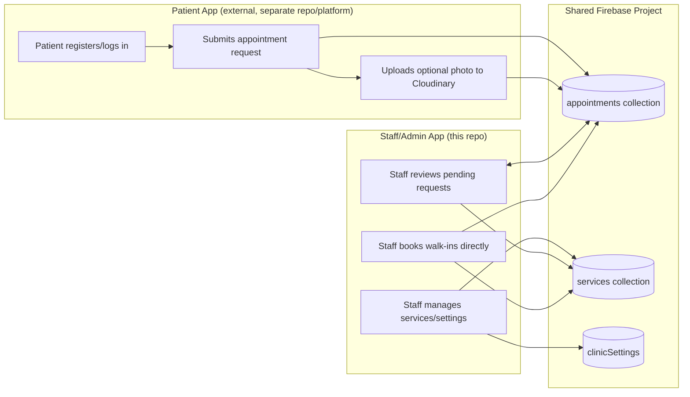
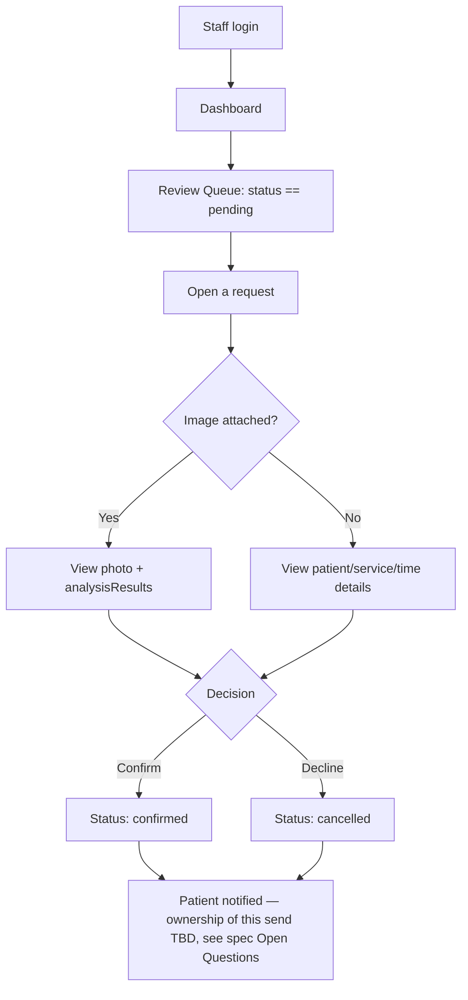
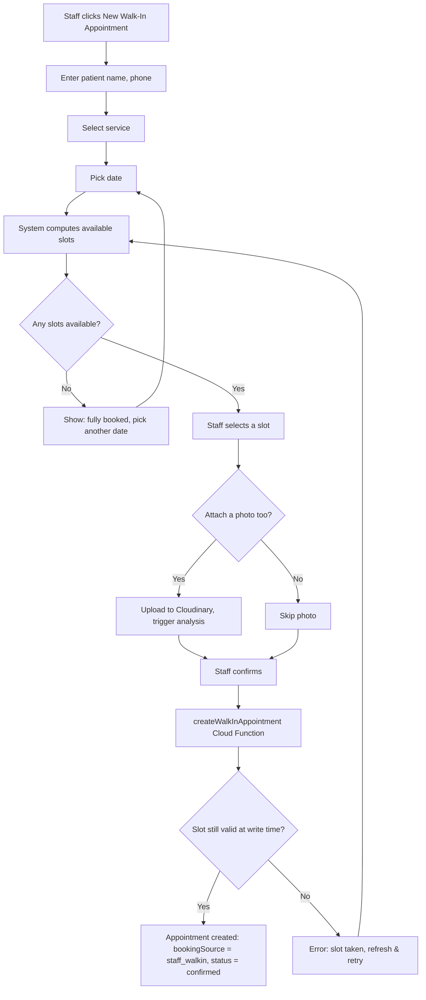
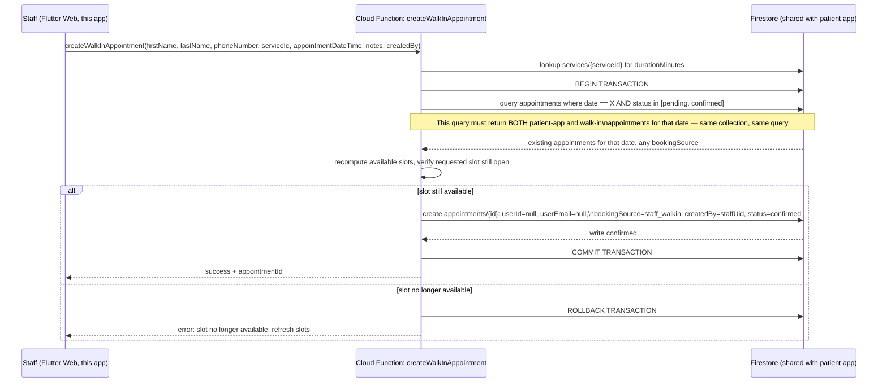
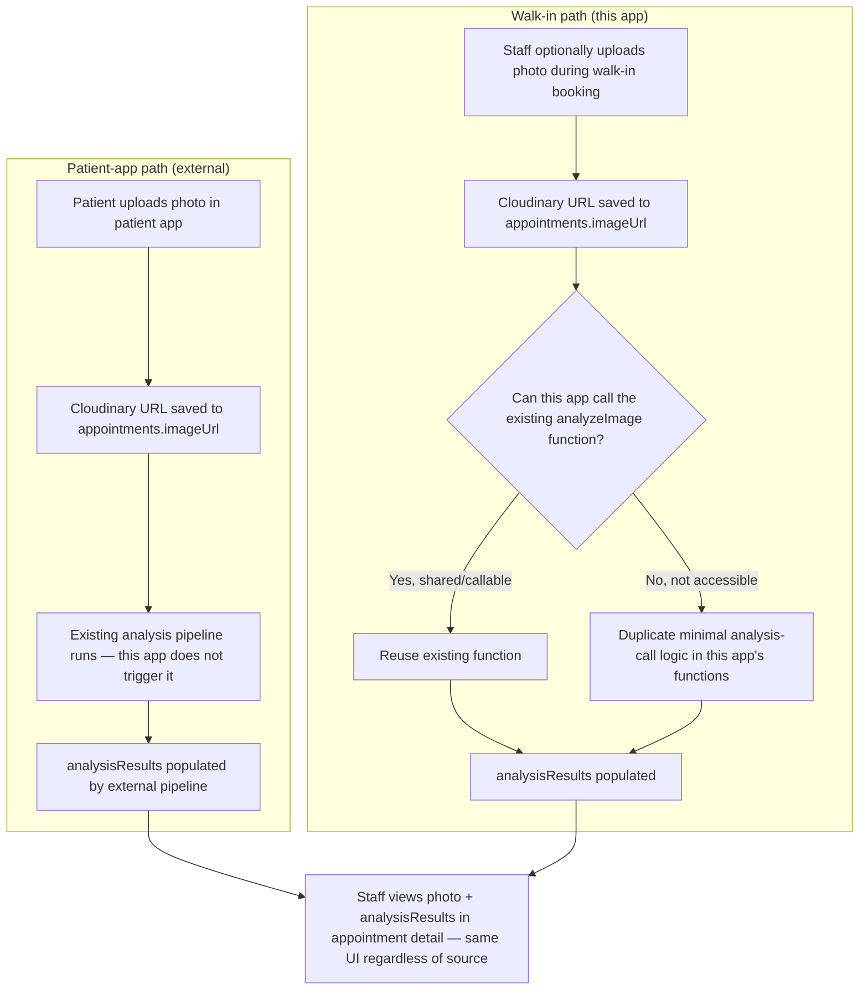
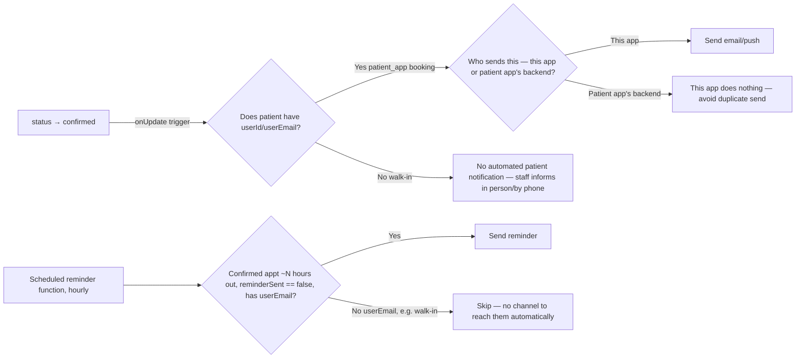
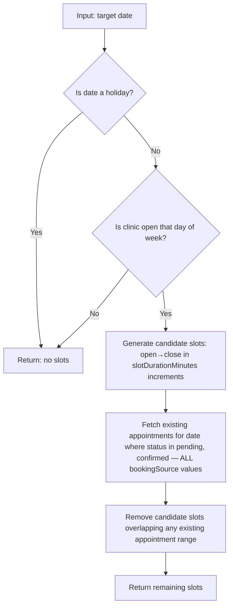

# App Workflow & Transaction Flow — Dental Clinic Staff/Admin App

> This repo is the **staff/admin-only** app. Patient registration and self-booking happen in a **separate, already-live app on a different platform** — those flows are shown below only as external context, not as something built in this repo. Both apps share the same Firestore project. Diagrams use Mermaid syntax.

---

## 1. Where This App Fits (system context)



**Key point:** this repo never creates a patient-app-originated appointment — it only reads/reviews those. It *does* create walk-in appointments directly.

---

## 2. Staff Journey — Reviewing Patient-App Requests



---

## 3. Staff Journey — Booking a Walk-In



Note the difference from the review flow: a walk-in goes straight to `confirmed`, since the staff member is both the requester and the approver — there's no separate party to wait on.

---

## 4. Booking Transaction Flow — Walk-In Path (the critical path for this app)



**Why this transaction is critical:** a patient could be submitting a request through the patient app for the same slot a staff member is booking as a walk-in, at nearly the same moment. Because both write to the same `appointments` collection, this app's transaction only protects against double-booking **if it reads the same collection the patient app writes to with an equivalent query** — this depends on the patient app using compatible logic. See the spec's Open Questions on slot-availability parity; this is the single biggest risk point in the whole system.

---

## 5. Appointment Status Lifecycle

```mermaid
stateDiagram-v2
    [*] --> pending: patient app creates request (external)
    [*] --> confirmed: staff creates walk-in (this app)
    pending --> confirmed: staff confirms
    pending --> cancelled: staff cancels
    confirmed --> cancelled: staff cancels
    confirmed --> completed: staff marks after visit
    confirmed --> no-show: staff marks after missed visit
    cancelled --> [*]
    completed --> [*]
    no-show --> [*]
```

Two distinct entry points into the state machine now: patient-app requests start at `pending`, walk-ins start at `confirmed` directly. Everything downstream of `confirmed` is identical regardless of source.

---

## 6. Image Handling — Two Separate Paths



Whichever path populated `imageUrl`/`analysisResults`, the staff-side **display** is identical — the appointment detail screen doesn't need to know or care which app triggered the upload.

---

## 7. Notification Trigger Flow (ownership TBD — see spec Open Questions)



This diagram intentionally shows the open decision point — **do not build the notification-sending Cloud Function until it's confirmed whether the patient app already handles this**, to avoid two systems both emailing the same patient.

---

## 8. Slot Availability Calculation



This logic must produce the **same result** whether run from this app (for walk-in booking) or from the patient app (for patient requests) — otherwise the two apps disagree about what's bookable, and the transaction in Section 4 can't fully prevent conflicts. Confirm the patient app's actual implementation matches this before relying on it.

---

## 9. Summary: What Must Never Happen (guardrails)

- ❌ This app writing/renaming/removing any patient-app-owned field (`userId`, `userEmail`, `firstName`, `lastName`, `phoneNumber`, `reason`, `imageUrl`, `analysisResults` for patient-app records)
- ❌ Fabricating a Firebase Auth user for a walk-in patient — `userId`/`userEmail` stay `null`
- ❌ Direct client write to `appointments` from this app — always through `createWalkInAppointment` or a status-update Cloud Function
- ❌ Booking a walk-in without re-validating slot availability inside a transaction that queries the *full* `appointments` collection (all `bookingSource` values)
- ❌ Re-triggering image analysis for a patient-app-originated appointment that already has `analysisResults`
- ❌ Building automated patient notifications before confirming the patient app doesn't already send them
- ❌ Assuming the patient app's slot-availability logic matches this app's without verifying it directly
